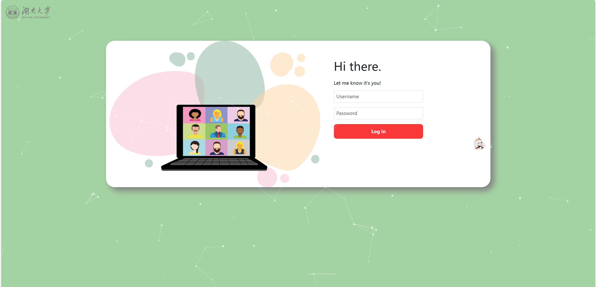
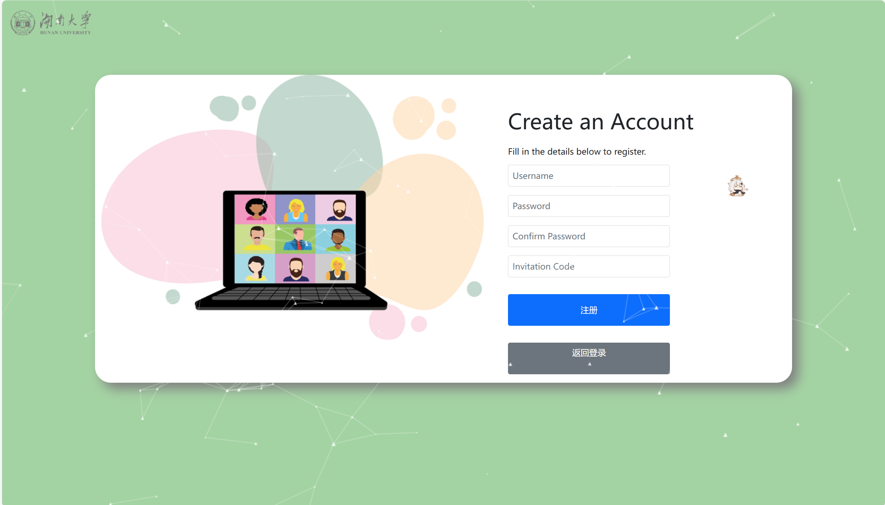
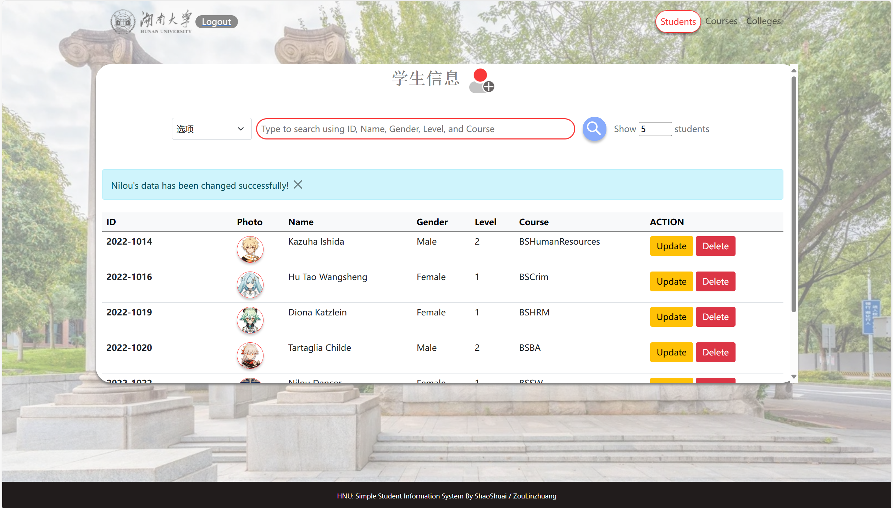
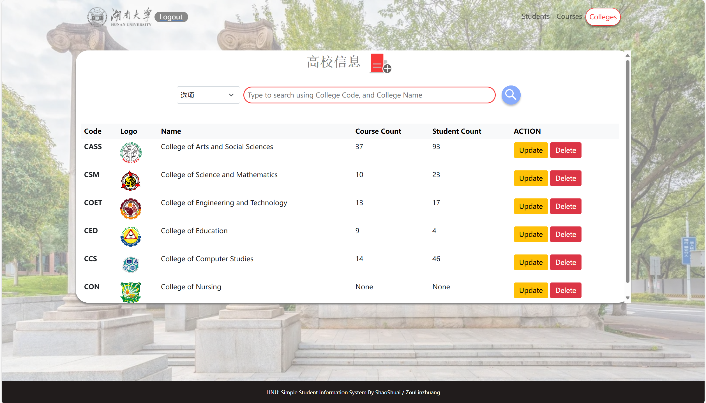

# 数据库原理大作业
## 系统环境
```shell
Distributor ID: Ubuntu
Description:    Ubuntu 22.04.4 LTS
Release:        22.04
Codename:       jammy
```
## 功能展示

登录界面



注册界面



学生界面



专业界面


高校界面



其中，学生模块、专业模块和高校模块都支持：

- 显示数据
- 添加数据
- 编辑数据
- 删除数据
- 搜索数据

## 环境配置

如果你是在服务器上运行，请确保你拥有 `sudo` 权限

克隆存储库到本地

```shell
git clone https://github.com/Obstacle19/Database_Web_System.git
```

安装所需的依赖

```shell
cd Database_Web_System
sudo pip install -i https://pypi.tuna.tsinghua.edu.cn/simple virtualenv # 安装 virtualenv
python3 -m venv flaskenv # 创建虚拟环境
source flaskenv/bin/activate # 启用虚拟环境
pip install -r requirements.txt
```

创建一个 `.env` 文件

```shell
touch .env
```

打开这个 `.env` 文件，输入以下内容

```shell
DB_HOST=your_database_host # 需要更改
DB_NAME=ssisdb
DB_USERNAME=your_database_username # 需要更改
DB_PASSWORD=your_database_password # 需要更改
SECRET_KEY=any_string_will_do

# 需要进入 https://console.cloudinary.com 网站，查询 Cloudinary 账户信息并复制到本文件中，否则上传的 studnet 图片无法显示
CLOUD_NAME = your_cloudinary_name # 需要更改
API_KEY = your_cloudinary_api_key # 需要更改
API_SECRET = your_cloudinary_api_secretkey # 需要更改
PHOTO_UPLOAD = cloud
```

创建一个 `.flaskenv` 文件

```shell
touch .flaskenv
```

打开这个 `.flaskenv` 文件，输入以下内容

```shell
FLASK_APP=ssis
FLASK_ENV=development
FLASK_RUN_PORT=8080
```

执行 SQL 脚本

```shell
mysql -u root -p
mysql > source /home/ss/Database_Web_System/db_script/script.sql # 请更改路径名
mysql > quit
```

## 运行程序

```shell
flask run
# 如果是虚拟机直接运行，只能在本地打开。运行 flask run --host=0.0.0.0 可以在主机打开
```
